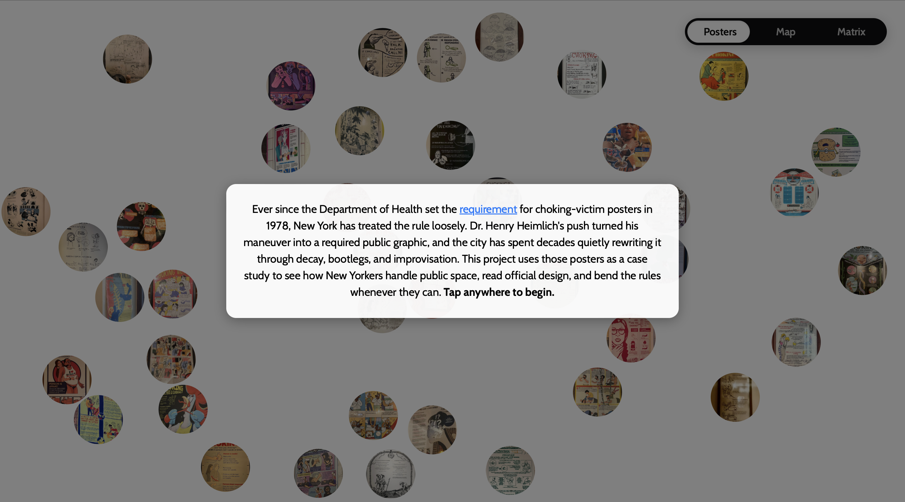
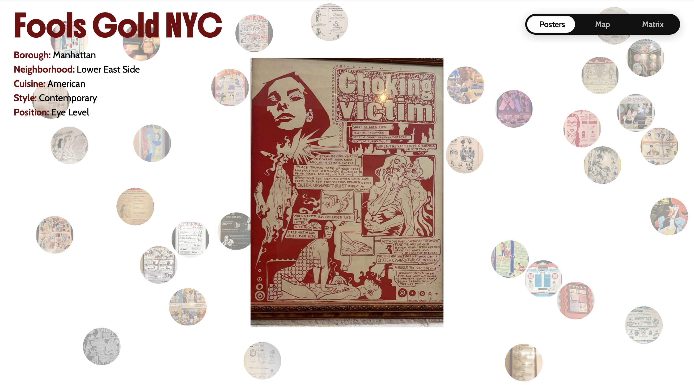
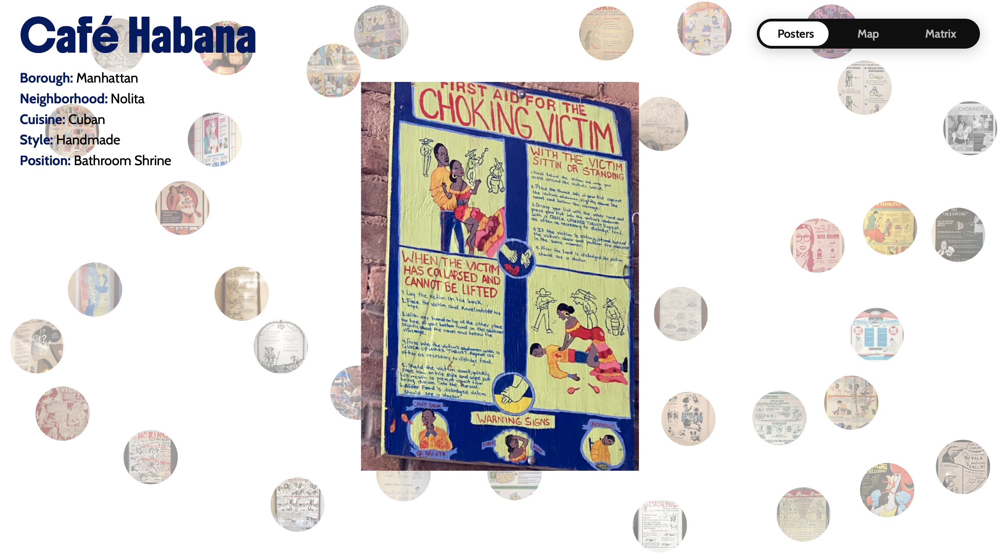
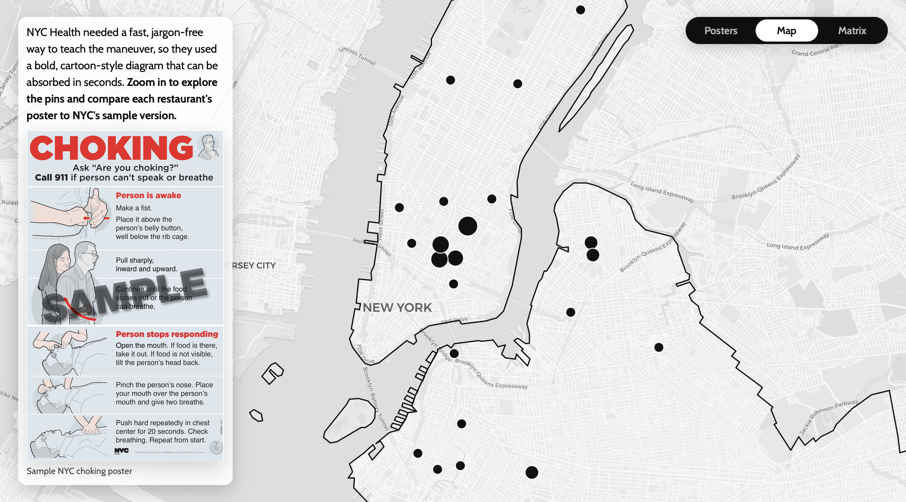
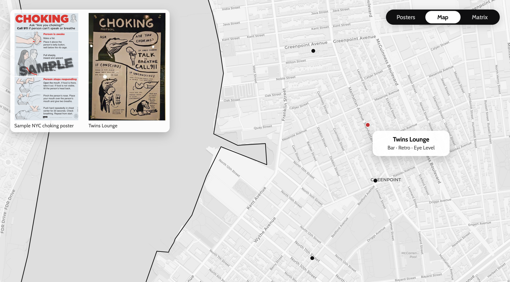
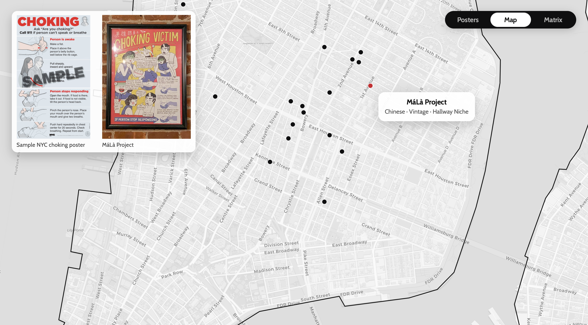
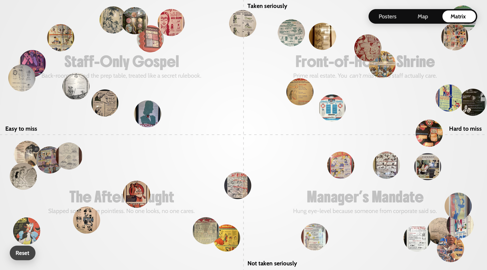
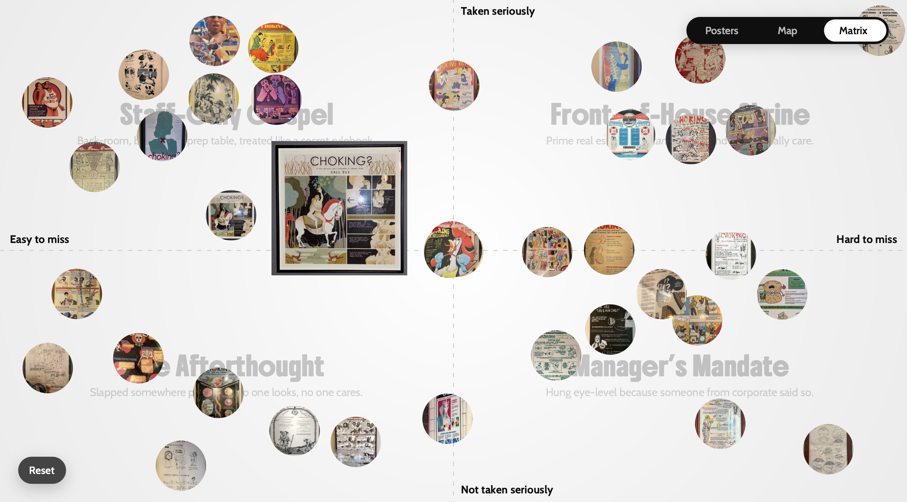

Ever since the Department of Health set the requirement for choking-victim posters in 1978, New York has treated the rule loosely. Dr. Henry Heimlich's push turned his maneuver into a required public graphic, and the city has spent decades quietly rewriting it through decay, bootlegs, and improvisation. [*Choke*](https://derinsavasan.github.io/choke/) uses those posters as a case study to see how New Yorkers handle public space, read official design, and bend the rules whenever they can.

## Screenshots

