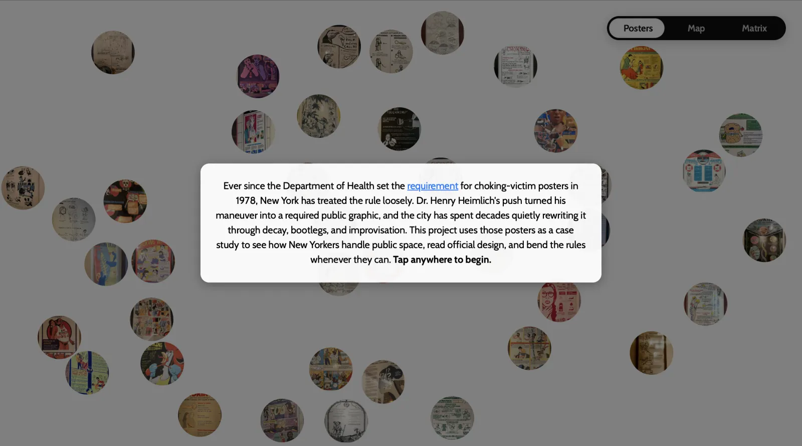
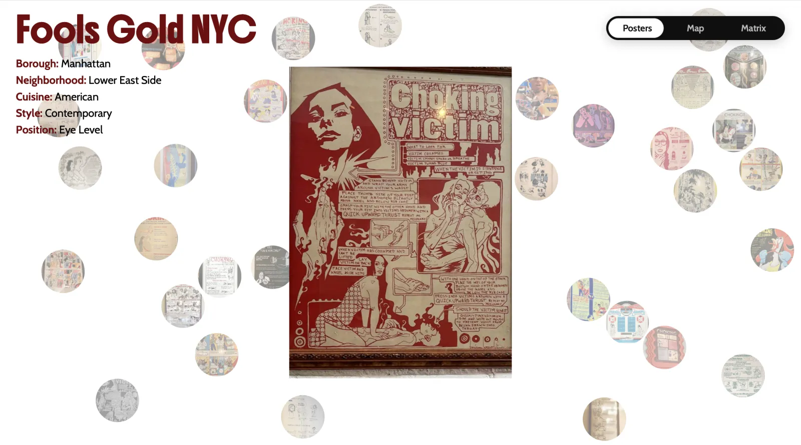
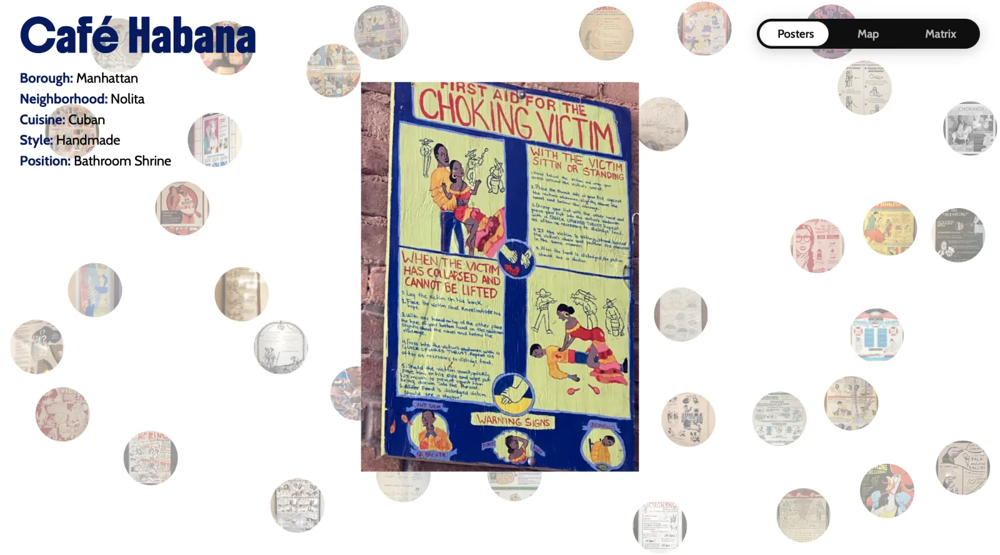
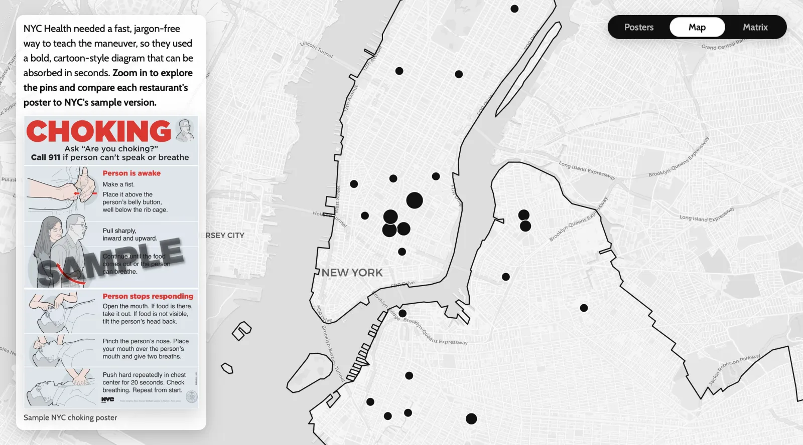
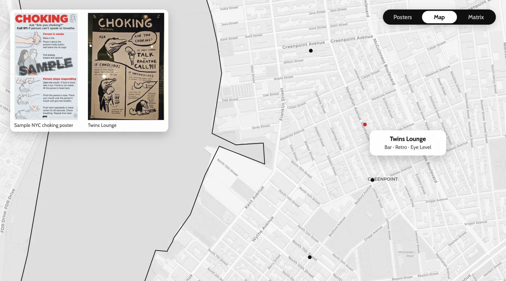
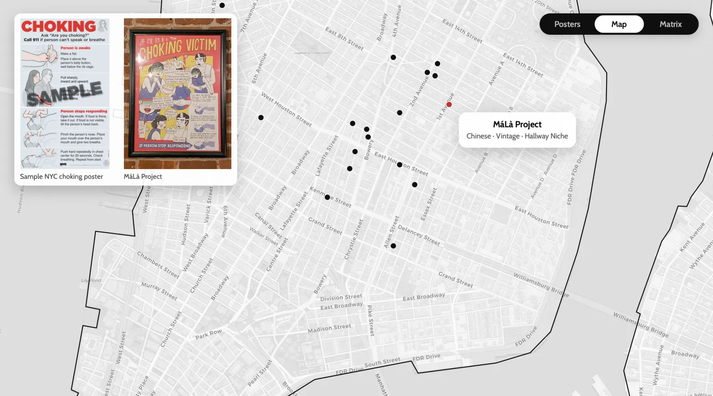
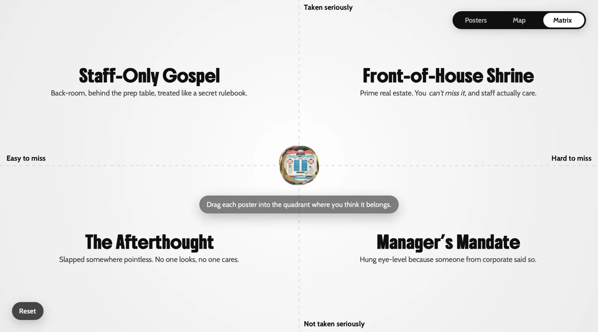
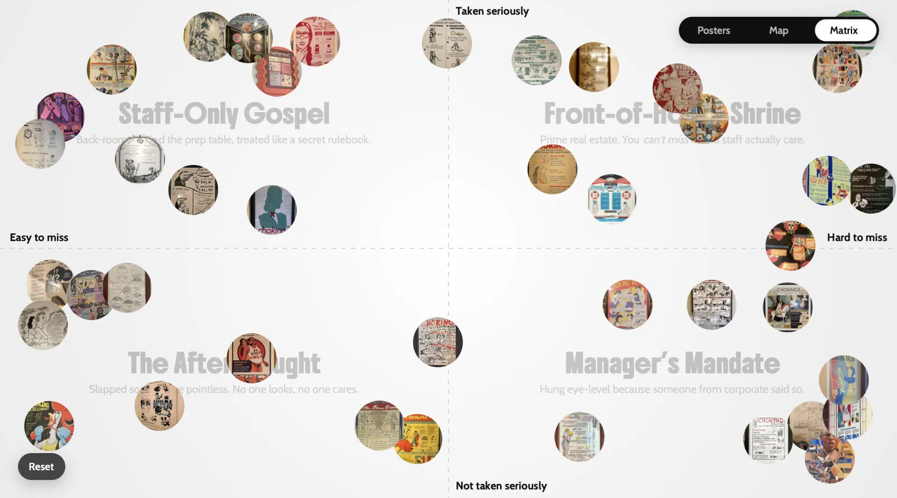
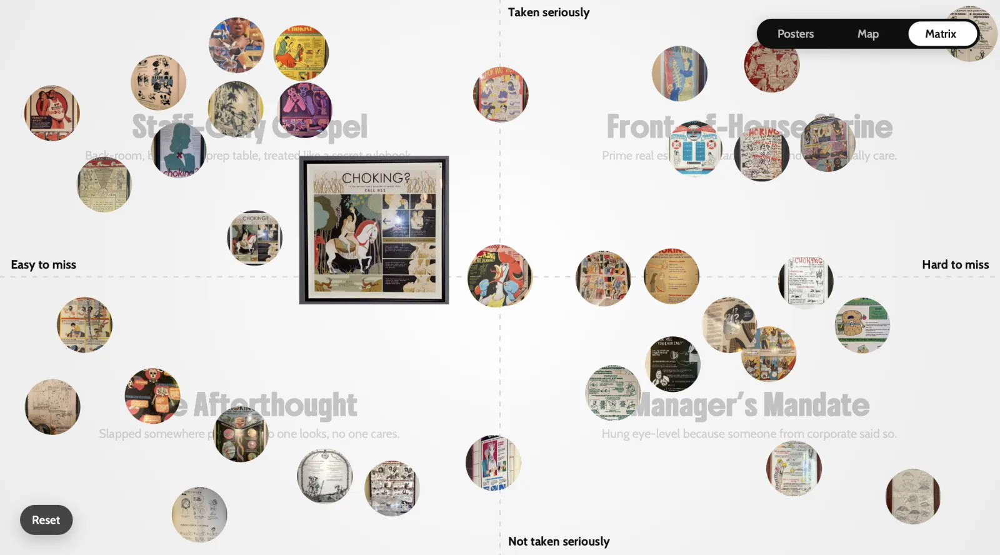

# Choke

Ever since the Department of Health set the [requirement](https://codelibrary.amlegal.com/codes/newyorkcity/latest/NYCadmin/0-0-0-27660) for choking-victim posters in 1978, New York has treated the rule loosely. Dr. Henry Heimlich's push turned his maneuver into a required public graphic, and the city has spent decades quietly rewriting it through decay, bootlegs, and improvisation. [Choke](https://derinsavasan.github.io/choke/) uses those posters as a case study to see how New Yorkers handle public space, read official design, and bend the rules whenever they can.



## The three views

The toggle in the top right switches between three ways of looking at the same collection of posters. Posters floats every one as a drifting bubble that bounces off its neighbors; click one to pull up the restaurant's details, with an accent color sampled straight from the poster. Map pins each poster where it was found, so you can zoom into a block and hold a restaurant's version up against NYC Health's official sample. Matrix drops the posters into a grid you sort yourself.

## How the matrix works

The matrix is a 2×2 grid built from two questions: how easy is the poster to miss, and how seriously is it treated? You drag each poster into the quadrant where you think it belongs, and the four corners describe the kinds of posting that tend to land there:

| Quadrant | Visibility | Treatment | What it feels like |
| --- | --- | --- | --- |
| Front-of-House Shrine | hard to miss | taken seriously | prime real estate; you can't miss it, and staff actually care |
| Staff-Only Gospel | easy to miss | taken seriously | back-room, behind the prep table, treated like a secret rulebook |
| Manager's Mandate | hard to miss | not taken seriously | hung eye-level because corporate said so |
| The Afterthought | easy to miss | not taken seriously | slapped somewhere pointless; no one looks, no one cares |

## The data

Each row in [`data-new/choke-me.csv`](data-new/choke-me.csv) is a single poster photographed in the field, tagged with its restaurant, borough, neighborhood, cuisine, the style of the sign, and where in the room it was hung, plus latitude and longitude for the map. The boroughs are drawn from [`data-new/nyc.geojson`](data-new/nyc.geojson), and every poster is meant to be read against [`data-new/choking-poster-sample.png`](data-new/choking-poster-sample.png), the version NYC Health hands out.

## Run locally

The site is plain static files, so any local server works and there's nothing to build:

```bash
python3 -m http.server 8000
# then open http://localhost:8000
```

## Built with

D3 v7 does most of the work: the spiral bubble layout, the color sampling, and the matrix grid. Leaflet draws the borough map. Everything else is plain JavaScript, HTML, and CSS, with no framework or build step.

## Sources

- The [1978 NYC requirement](https://codelibrary.amlegal.com/codes/newyorkcity/latest/NYCadmin/0-0-0-27660) for choking-victim posters
- NYC Health's official sample poster, used as the reference design
- Posters photographed in person at restaurants across the city

## Screenshots









